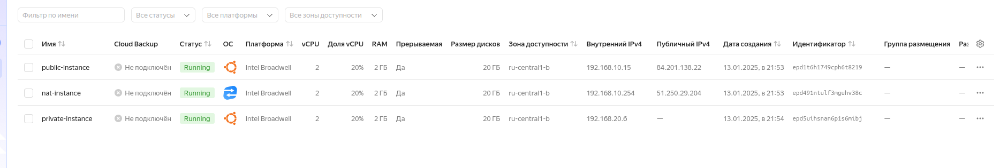
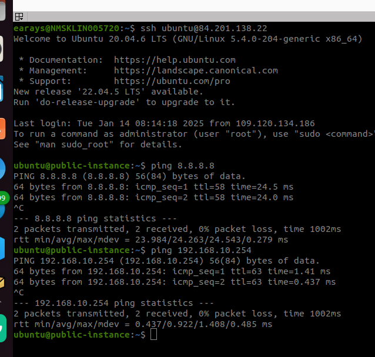
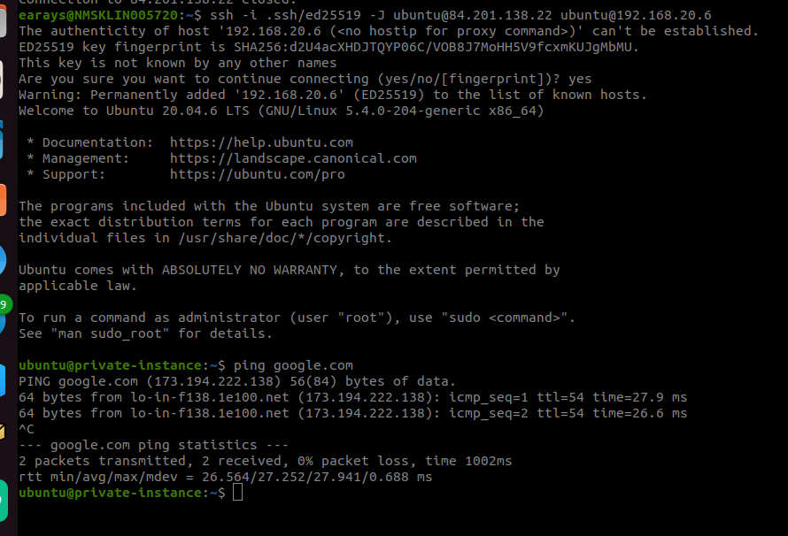
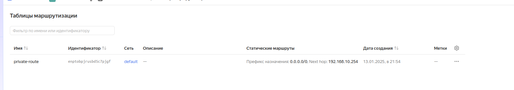

# Организация сети

### Задание 1. Yandex Cloud 

**Что нужно сделать**

1. Создать пустую VPC. Выбрать зону.
2. Публичная подсеть.

 - Создать в VPC subnet с названием public, сетью 192.168.10.0/24.
 - Создать в этой подсети NAT-инстанс, присвоив ему адрес 192.168.10.254. В качестве image_id использовать fd80mrhj8fl2oe87o4e1.
 - Создать в этой публичной подсети виртуалку с публичным IP, подключиться к ней и убедиться, что есть доступ к интернету.
3. Приватная подсеть.
 - Создать в VPC subnet с названием private, сетью 192.168.20.0/24.
 - Создать route table. Добавить статический маршрут, направляющий весь исходящий трафик private сети в NAT-инстанс.
 - Создать в этой приватной подсети виртуалку с внутренним IP, подключиться к ней через виртуалку, созданную ранее, и убедиться, что есть доступ к интернету.

Resource Terraform для Yandex Cloud:

- [VPC subnet](https://registry.terraform.io/providers/yandex-cloud/yandex/latest/docs/resources/vpc_subnet).
- [Route table](https://registry.terraform.io/providers/yandex-cloud/yandex/latest/docs/resources/vpc_route_table).
- [Compute Instance](https://registry.terraform.io/providers/yandex-cloud/yandex/latest/docs/resources/compute_instance).

------

## Ответ

### Задание 1.

Созданные instance под нашу `VPC` на `Yandex.Cloud`

Подключаемся по `SSH` к `VPC` с внешним IP-адресом _public-instance_, проверяем наличие доступа в интернет и связь с NAT-шлюзом

Проверяем видимость `VPC` из сети `private` _private-instance_ и подключаемся черезе bastion host (public_instance)
и проверяем доступность интернета с `VPC` _private-instance_

Созданные подсети в web-консоли на `Yandex.Cloud`

Таблица маршрутизации в web-консоли на `Yandex.Cloud`

