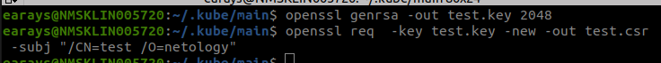
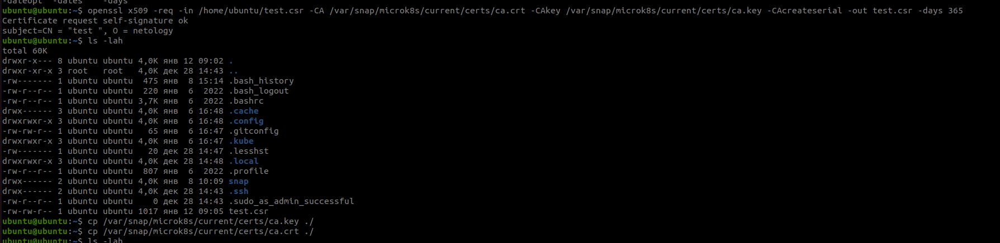
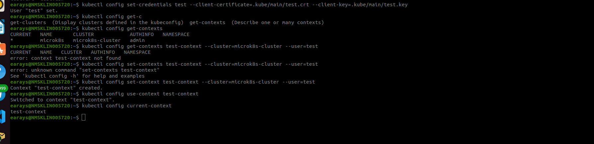
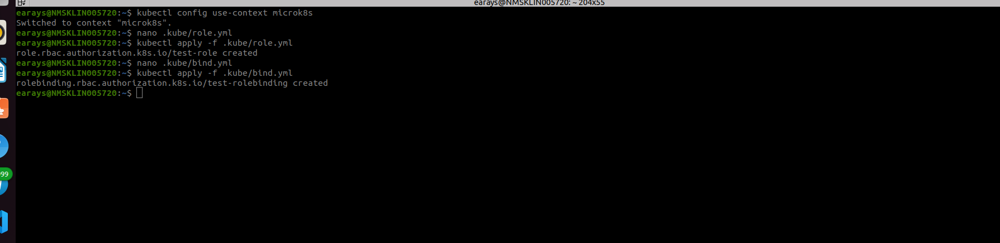
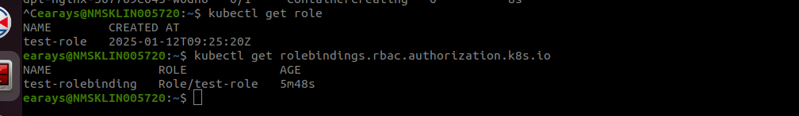

# Управление доступом


### Инструменты / дополнительные материалы, которые пригодятся для выполнения задания

1. [Описание](https://kubernetes.io/docs/reference/access-authn-authz/rbac/) RBAC.
2. [Пользователи и авторизация RBAC в Kubernetes](https://habr.com/ru/company/flant/blog/470503/).
3. [RBAC with Kubernetes in Minikube](https://medium.com/@HoussemDellai/rbac-with-kubernetes-in-minikube-4deed658ea7b).

------

### Задание 1. Создайте конфигурацию для подключения пользователя

1. Создайте и подпишите SSL-сертификат для подключения к кластеру.



Коммандой
```bash
scp ./test.csr ubuntu@192.168.56.81:/home/ubuntu/ 
```
переносим test.csr на сервер с microk8s.

Подписываем сертификат



2. Настройте конфигурационный файл kubectl для подключения.



3. Создайте роли и все необходимые настройки для пользователя.



4. Предусмотрите права пользователя. Пользователь может просматривать логи подов и их конфигурацию (`kubectl logs pod <pod_id>`, `kubectl describe pod <pod_id>`).



5. Предоставьте манифесты и скриншоты и/или вывод необходимых команд.

[deployment](./deploy_nginx.yml)

[role](./role.yml)

[binding](./bind.yml)
