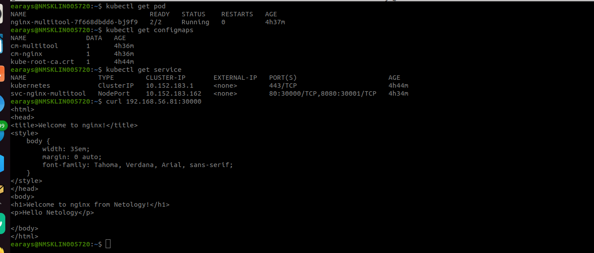

# Конфигурация приложений


### Инструменты и дополнительные материалы, которые пригодятся для выполнения задания

1. [Описание](https://kubernetes.io/docs/concepts/configuration/secret/) Secret.
2. [Описание](https://kubernetes.io/docs/concepts/configuration/configmap/) ConfigMap.
3. [Описание](https://github.com/wbitt/Network-MultiTool) Multitool.

------

### Задание 1. Создать Deployment приложения и решить возникшую проблему с помощью ConfigMap. Добавить веб-страницу

1. Создать Deployment приложения, состоящего из контейнеров nginx и multitool.

```yaml
apiVersion: apps/v1
kind: Deployment
metadata:
  labels:
    app: web
  name: nginx-multitool
spec:
  selector:
    matchLabels:
      app: web
  replicas: 1
  template:
    metadata:
      labels:
        app: web
    spec:
      containers:
      - name: multitool
        image: wbitt/network-multitool
        ports:
        - name: multitool-port
          containerPort: 8080
        env:
        - name: HTTP_PORT
          valueFrom:
            configMapKeyRef:
              name: cm-multitool
              key: value
      - name: nginx
        image: nginx:latest
        ports:
        - containerPort: 80
        volumeMounts:
        - name: nginx-page
          mountPath: /usr/share/nginx/html/index.html
          subPath: index.html
      volumes:
      - name: nginx-page
        configMap:
          name: cm-nginx
```

2. Решить возникшую проблему с помощью ConfigMap.

```yaml
apiVersion: v1
kind: ConfigMap
metadata:
  name: cm-multitool
data:
  value: "8080"
```

```yaml
apiVersion: v1
kind: ConfigMap
metadata:
  name: cm-nginx
data:
  index.html: |
    <html>
    <head>
    <title>Welcome to nginx!</title>
    <style>
        body {
            width: 35em;
            margin: 0 auto;
            font-family: Tahoma, Verdana, Arial, sans-serif;
        }
    </style>
    </head>
    <body>
    <h1>Welcome to nginx from Netology!</h1>
    <p>Hello Netology</p>

    </body>
    </html>
```

3. Продемонстрировать, что pod стартовал и оба конейнера работают.


4. Сделать простую веб-страницу и подключить её к Nginx с помощью ConfigMap. Подключить Service и показать вывод curl или в браузере.

```yaml
apiVersion: v1
kind: Service
metadata:
  name: svc-nginx-multitool
spec:
  ports:
    - name: http-nginx
      port: 80
      nodePort: 30000
    - name: http-multitool
      port: 8080
      nodePort: 30001
  selector:
    app: web
  type: NodePort
```

5. Предоставить манифесты, а также скриншоты или вывод необходимых команд.




[deployment](./deploy_nginx_multitool.yml)

[configuration_multitools](./config_multitool.yml)

[configariton_nginx](./config_nginx.yml)

[service](./service.yml)

------

### Задание 2. Создать приложение с вашей веб-страницей, доступной по HTTPS 

1. Создать Deployment приложения, состоящего из Nginx.

```yaml
apiVersion: apps/v1
kind: Deployment
metadata:
  labels:
    app: web
  name: dpl-nginx
  namespace: netology
spec:
  selector:
    matchLabels:
      app: web
  replicas: 1
  template:
    metadata:
      labels:
        app: web
    spec:
      containers:
      - name: nginx
        image: nginx:1.19.2
        ports:
        - containerPort: 80
        volumeMounts:
        - name: nginx-page
          mountPath: /usr/share/nginx/html/index.html
          subPath: index.html
      volumes:
      - name: nginx-page
        configMap:
          name: cm-nginx
```
2. Создать собственную веб-страницу и подключить её как ConfigMap к приложению.

```yaml
apiVersion: v1
kind: ConfigMap
metadata:
  name: cm-nginx
data:
  index.html: |
    <html>
    <head>
    <title>Welcome to nginx!</title>
    <style>
        body {
            width: 35em;
            margin: 0 auto;
            font-family: Tahoma, Verdana, Arial, sans-serif;
        }
    </style>
    </head>
    <body>
    <h1>Welcome to nginx from Netology!</h1>
    <p>Hello Netology</p>

    </body>
    </html>
```

3. Выпустить самоподписной сертификат SSL. Создать Secret для использования сертификата.

```bash
openssl req -x509 -days 365 -newkey rsa:2048 -sha256 -nodes -keyout nginx.key -out nginx.crt -subj "/CN=ingress.test"

kubectl create secret tls nginx-tls --cert=nginx.crt --key=nginx.key
```


4. Создать Ingress и необходимый Service, подключить к нему SSL в вид. Продемонстировать доступ к приложению по HTTPS. 

```yaml
apiVersion: networking.k8s.io/v1
kind: Ingress
metadata:
  name: ingress
  annotations:
    nginx.ingress.kubernetes.io/rewrite-target: /
spec:
  rules:
    - host: ingress.test
      http:
        paths:
          - path: /
            pathType: Prefix
            backend:
              service:
                name: svc-nginx
                port:
                  name: nginx-http
  tls:
    - hosts:
      - ingress.test
      secretName: tls-crt
```

4. Предоставить манифесты, а также скриншоты или вывод необходимых команд.

[deployment](./deploy_nginx.yml)

[configariton_nginx](./config_nginx.yml)

[secret](./secret.yml)

[ingress](./ingress.yml)
