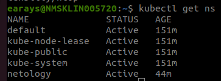
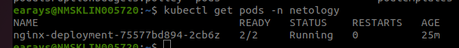
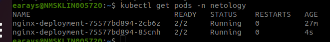
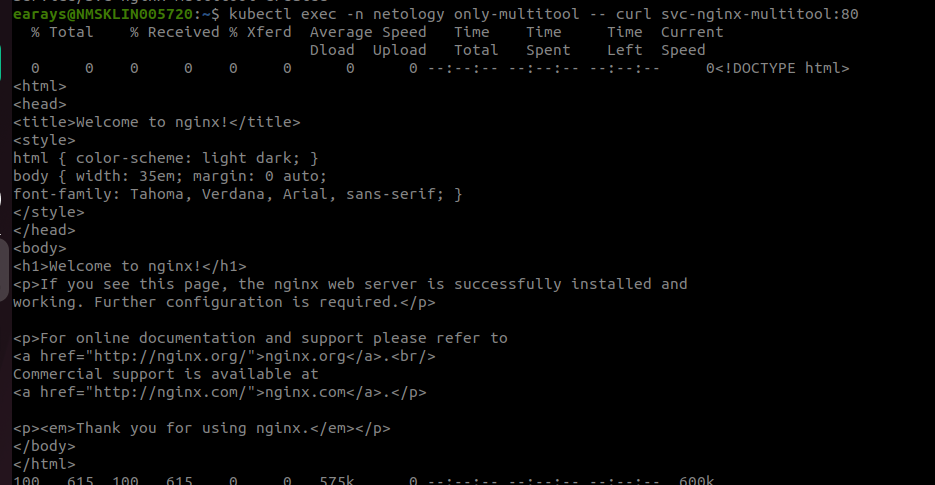
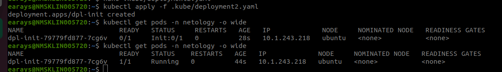
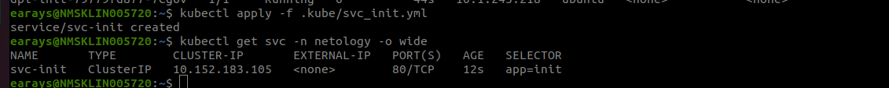

# Запуск приложений в K8S

### Инструменты и дополнительные материалы, которые пригодятся для выполнения задания

1. [Описание](https://kubernetes.io/docs/concepts/workloads/controllers/deployment/) Deployment и примеры манифестов.
2. [Описание](https://kubernetes.io/docs/concepts/workloads/pods/init-containers/) Init-контейнеров.
3. [Описание](https://github.com/wbitt/Network-MultiTool) Multitool.

------

### Создать Deployment и обеспечить доступ к репликам приложения из другого Pod

1. Создать Deployment приложения, состоящего из двух контейнеров — nginx и multitool. Решить возникшую ошибку.

Создаем отдельный namespace:

```yaml
apiVersion: v1
kind: Namespace
metadata:
  name: netology
  namespace: netology
```


Создаем deployment:

```yaml
apiVersion: apps/v1
kind: Deployment
metadata:
  name: nginx-deployment
  namespace: netology
spec:
  replicas: 1
  selector:
    matchLabels:
      app: web
  template:
    metadata:
      labels:
        app: web
    spec:
      containers:
      - name: nginx
        image: nginx:latest
      - name: multitool
        image: praqma/network-multitool
        env:
          - name: HTTP_PORT
            value: "1800"
```

Решение проблемы - замена рабочего порта приложения на "1800"




2. После запуска увеличить количество реплик работающего приложения до 2.



3. Продемонстрировать количество подов до и после масштабирования.

до:


после:


4. Создать Service, который обеспечит доступ до реплик приложений из п.1.

```yaml
apiVersion: v1
kind: Service
metadata:
  name: svc-nginx-multitool
  namespace: netology
spec:
  ports:
    - name: http-app
      port: 80
      protocol: TCP
      targetPort: 80
    - name: https-app
      port: 443
      protocol: TCP
      targetPort: 443
    - name: http-multitool
      port: 1800
      protocol: TCP
      targetPort: 1800
  selector:
    app: web
```

5. Создать отдельный Pod с приложением multitool и убедиться с помощью `curl`, что из пода есть доступ до приложений из п.1.


```yaml 
# multitool.yaml
apiVersion: v1
kind: Pod
metadata:
  name: only-multitool
  namespace: netology
spec:
  containers:
    - image: wbitt/network-multitool
      name: nginx
```



------

###  Создать Deployment и обеспечить старт основного контейнера при выполнении условий

1. Создать Deployment приложения nginx и обеспечить старт контейнера только после того, как будет запущен сервис этого приложения.

```yaml 
# deployment2
apiVersion: apps/v1
kind: Deployment
metadata:
  name: dpl-init
  namespace: netology
spec:
  replicas: 1 
  selector:
    matchLabels:
      app: init
  template:
    metadata:
      labels:
        app: init
    spec:
      containers:
      - name: nginx
        image: nginx:1.19.2
      initContainers:
      - name: busybox
        image: busybox
        command: ['sleep', '30']
```

2. Убедиться, что nginx не стартует. В качестве Init-контейнера взять busybox.



3. Создать и запустить Service. Убедиться, что Init запустился.

```yaml
apiVersion: v1
kind: Service
metadata:
  name: svc-init
  namespace: netology
spec:
  ports:
    - name: http-app
      port: 80 
  selector:
    app: init
```



4. Продемонстрировать состояние пода до и после запуска сервиса.

------
