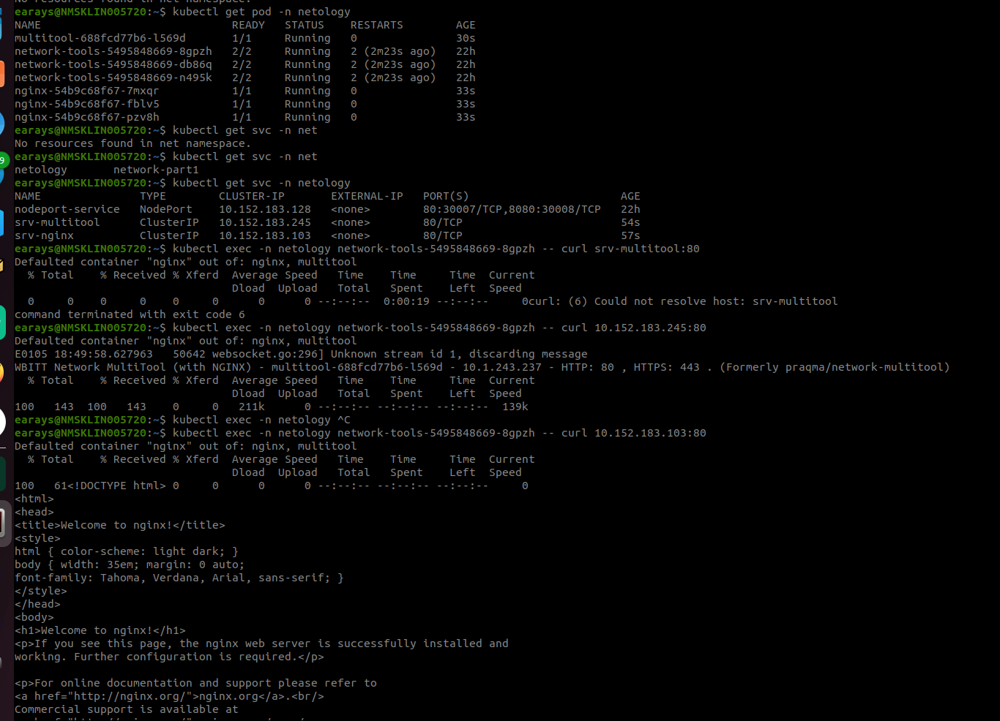
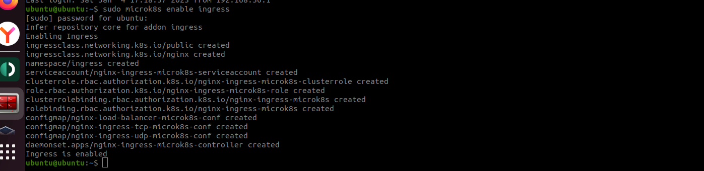
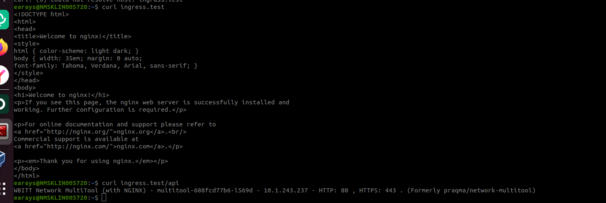

# Сетевое взаимодействие в K8S. Часть 2

### Инструменты и дополнительные материалы, которые пригодятся для выполнения задания

1. [Инструкция](https://microk8s.io/docs/getting-started) по установке MicroK8S.
2. [Описание](https://kubernetes.io/docs/concepts/services-networking/service/) Service.
3. [Описание](https://kubernetes.io/docs/concepts/services-networking/ingress/) Ingress.
4. [Описание](https://github.com/wbitt/Network-MultiTool) Multitool.

------

### Задание 1. Создать Deployment приложений backend и frontend

1. Создать Deployment приложения _frontend_ из образа nginx с количеством реплик 3 шт.

```yaml
apiVersion: apps/v1
kind: Deployment
metadata:
  name: nginx
  namespace: netology
  labels:
    app: nginx
spec:
  replicas: 3
  selector:
    matchLabels:
      app: nginx
  template:
    metadata:
      labels:
        app: nginx
    spec:
      containers:
      - name: nginx
        image: nginx:latest
        ports:
        - containerPort: 80

---
apiVersion: v1
kind: Service
metadata:
  name: srv-nginx
  namespace: netology
spec:
  ports:
    - name: nginx
      port: 80
  selector:
    app: nginx
```
2. Создать Deployment приложения _backend_ из образа multitool. 


```yaml
apiVersion: apps/v1
kind: Deployment
metadata:
  name: multitool
  namespace: netology
spec:
  replicas: 1
  selector:
    matchLabels:
      app: multitool
  template:
    metadata:
      labels:
        app: multitool
    spec:
      containers:
        - image: wbitt/network-multitool
          name: multitool

---
apiVersion: v1
kind: Service
metadata:
  name: srv-multitool
  namespace: netology
spec:
  ports:
    - name: multitool
      port: 80
  selector:
    app: multitool
```

3. Добавить Service, которые обеспечат доступ к обоим приложениям внутри кластера. 
4. Продемонстрировать, что приложения видят друг друга с помощью Service.
5. Предоставить манифесты Deployment и Service в решении, а также скриншоты или вывод команды п.4.



[frontend](./deploy_frontend.yml)

[backend](./deploy_backend.yml)

------

### Задание 2. Создать Ingress и обеспечить доступ к приложениям снаружи кластера

1. Включить Ingress-controller в MicroK8S.



2. Создать Ingress, обеспечивающий доступ снаружи по IP-адресу кластера MicroK8S так, чтобы при запросе только по адресу открывался _frontend_ а при добавлении /api - _backend_.
3. Продемонстрировать доступ с помощью браузера или `curl` с локального компьютера.
4. Предоставить манифесты и скриншоты или вывод команды п.2.



[ingress](ingress.yml)