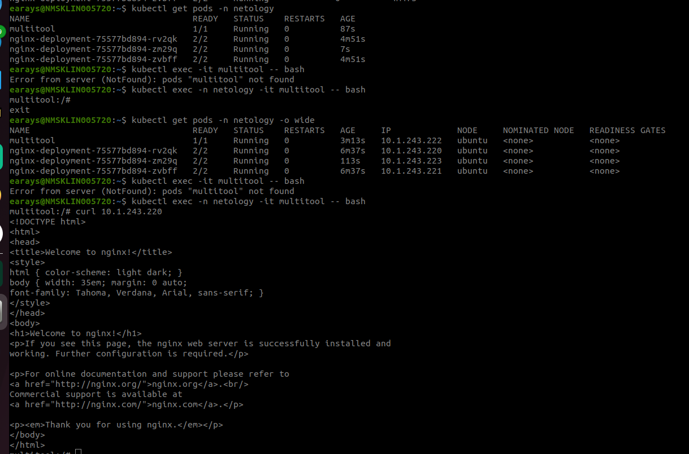
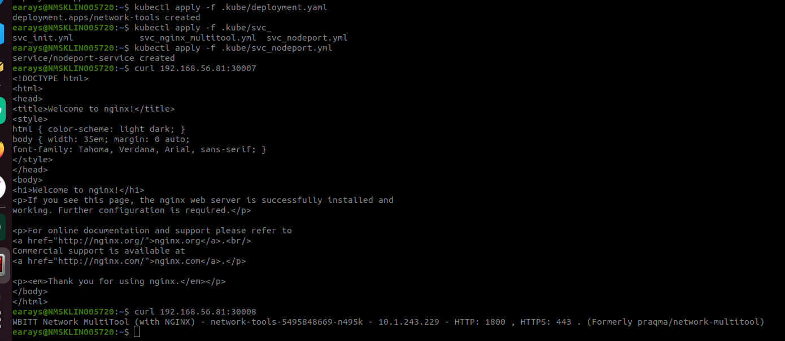

# Сетевое взаимодействие в K8S

### Задание 1. Создать Deployment и обеспечить доступ к контейнерам приложения по разным портам из другого Pod внутри кластера

1. Создать Deployment приложения, состоящего из двух контейнеров (nginx и multitool), с количеством реплик 3 шт.

```yaml
apiVersion: apps/v1
kind: Deployment
metadata:
  name: network-tools
  namespace: netology
spec:
  selector:
    matchLabels:
      app: nettools
  replicas: 3
  template:
    metadata:
      labels:
        app: nettools
    spec:
      containers:
      - name: nginx
        image: nginx:1.25.4
        ports:
        - containerPort: 80
      - name: multitool
        image: wbitt/network-multitool
        ports:
        - containerPort: 8080
        env: 
          - name: HTTP_PORT
            value: "1800"
```

2. Создать Service, который обеспечит доступ внутри кластера до контейнеров приложения из п.1 по порту 9001 — nginx 80, по 9002 — multitool 8080.

```yaml
apiVersion: v1
kind: Service
metadata:
  name: network-service
  namespace: netology
spec:
  selector:
    app: nettools
  ports:
    - protocol: TCP
      name: nginx
      port: 9001
      targetPort: 80
    - protocol: TCP
      name: multitool
      port: 9002
      targetPort: 1800
```

3. Создать отдельный Pod с приложением multitool и убедиться с помощью `curl`, что из пода есть доступ до приложения из п.1 по разным портам в разные контейнеры.

```yaml
apiVersion: v1
kind: Pod
metadata:
   name: multitool
   namespace: netology
spec:
   containers:
     - name: multitool
       image: wbitt/network-multitool
       ports:
        - containerPort: 8080
```


4. Продемонстрировать доступ с помощью `curl` по доменному имени сервиса.
5. Предоставить манифесты Deployment и Service в решении, а также скриншоты или вывод команды п.4.

[deployment](deployment.yaml)

[service](svc_init.yml)

[multitool](multitool.yml)

------

### Задание 2. Создать Service и обеспечить доступ к приложениям снаружи кластера

1. Создать отдельный Service приложения из Задания 1 с возможностью доступа снаружи кластера к nginx, используя тип NodePort.

```yaml
apiVersion: v1
kind: Service
metadata:
  name: nodeport-service
  namespace: netology
spec:
  type: NodePort
  selector:
    app: nettools
  ports:
    - port: 80
      name: nginx-port
      targetPort: 80
      nodePort: 30007
    - port: 8080
      name: multitool-port
      targetPort: 1800
      nodePort: 30008
```

2. Продемонстрировать доступ с помощью браузера или `curl` с локального компьютера.



3. Предоставить манифест и Service в решении, а также скриншоты или вывод команды п.2.

[Service_nodeport](./svc_nodeport.yml)

------