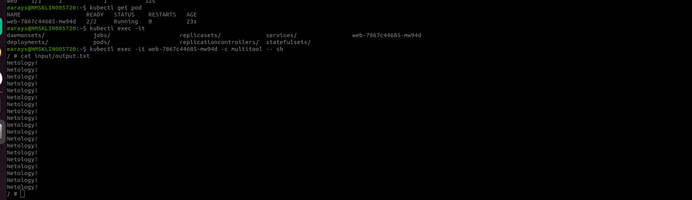
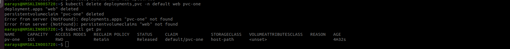
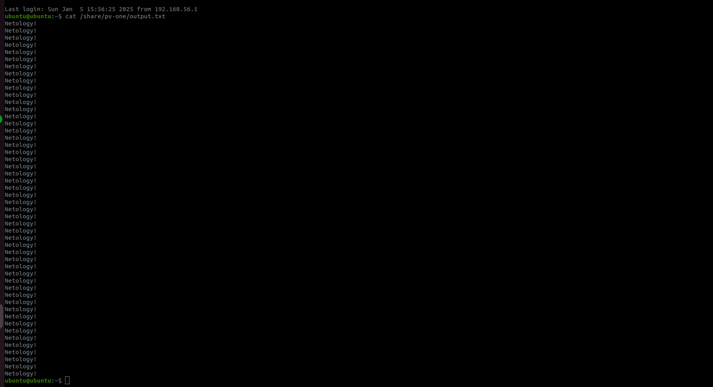
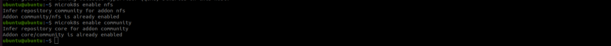

# Хранение в K8s. Часть 2


### Дополнительные материалы для выполнения задания

1. [Инструкция по установке NFS в MicroK8S](https://microk8s.io/docs/nfs). 
2. [Описание Persistent Volumes](https://kubernetes.io/docs/concepts/storage/persistent-volumes/). 
3. [Описание динамического провижининга](https://kubernetes.io/docs/concepts/storage/dynamic-provisioning/). 
4. [Описание Multitool](https://github.com/wbitt/Network-MultiTool).

------

### Задание 1

**Что нужно сделать**

Создать Deployment приложения, использующего локальный PV, созданный вручную.

1. Создать Deployment приложения, состоящего из контейнеров busybox и multitool.

```yaml
apiVersion: apps/v1
kind: Deployment
metadata:
  name: web
  labels:
    app: web
spec:
  replicas: 1
  selector:
    matchLabels:
      app: web
  template:
    metadata:
      labels:
        app: web
    spec:
      containers:
      - name: busybox
        image: busybox
        command: ['sh', '-c', 'while true; do echo Netology! >> /output/output.txt; sleep 5; done']
        volumeMounts:
        - name: volume
          mountPath: /output
      - name: multitool
        image: wbitt/network-multitool:latest
        ports:
        - containerPort: 80
        env:
        - name: HTTP_PORT
          value: "80"
        volumeMounts:
        - name: volume
          mountPath: /input
      volumes:
      - name: volume
        persistentVolumeClaim:
          claimName: pvc-one
```

2. Создать PV и PVC для подключения папки на локальной ноде, которая будет использована в поде.

```yaml
# pv
apiVersion: v1
kind: PersistentVolume
metadata:
  name: pv-one
spec:
  storageClassName: host-path
  capacity:
    storage: 1Gi
  accessModes:
  - ReadWriteOnce
  hostPath:
    path: /share/pv-one
```
```yaml
#pvc
apiVersion: v1
kind: PersistentVolumeClaim
metadata:
  name: pvc-one
spec:
  storageClassName: host-path
  volumeMode: Filesystem
  accessModes:
  - ReadWriteOnce
  resources:
    requests:
      storage: 1Gi
```


3. Продемонстрировать, что multitool может читать файл, в который busybox пишет каждые пять секунд в общей директории. 



4. Удалить Deployment и PVC. Продемонстрировать, что после этого произошло с PV. Пояснить, почему.



Вывод: после удаления PVC, PV сменил статус с Bound на Released, так как больше не свзан с PVC.


5. Продемонстрировать, что файл сохранился на локальном диске ноды. Удалить PV.  Продемонстрировать что произошло с файлом после удаления PV. Пояснить, почему.



Вывод: политика Reclaim Policy: Retain сохраняет файлы даже после удаления PV.

5. Предоставить манифесты, а также скриншоты или вывод необходимых команд.

[deployment](./deploy_pv.yml)

[pv](./pv.yml)

[pvc](./pvc.yml)

------

### Задание 2

**Что нужно сделать**

Создать Deployment приложения, которое может хранить файлы на NFS с динамическим созданием PV.

1. Включить и настроить NFS-сервер на MicroK8S.



2. Создать Deployment приложения состоящего из multitool, и подключить к нему PV, созданный автоматически на сервере NFS.

```yaml
apiVersion: apps/v1
kind: Deployment
metadata:
  name: multitool
  labels:
    app: nfs
spec:
  replicas: 1
  selector:
    matchLabels:
      app: nfs
  template:
    metadata:
      labels:
        app: nfs
    spec:
      containers:
      - name: multitool
        image: wbitt/network-multitool:latest
        ports:
        - containerPort: 80
        env:
        - name: HTTP_PORT
          value: "80"
        volumeMounts:
        - name: volume-nfs
          mountPath: /input
      volumes:
      - name: volume-nfs
        persistentVolumeClaim:
          claimName: pvc-nfs
```


```yaml
#pvc-nfs
---
apiVersion: v1
kind: PersistentVolumeClaim
metadata:
  name: pvc-nfs
spec:
  storageClassName: "nfs"
  accessModes:
  - ReadWriteOnce
  resources:
    requests:
      storage: 1Gi
```

3. Продемонстрировать возможность чтения и записи файла изнутри пода. 
4. Предоставить манифесты, а также скриншоты или вывод необходимых команд.

[deployment-nfs](./deploy_pv-nfs.yml)

[pvc-nfs](./pvc-nfs.yml)
