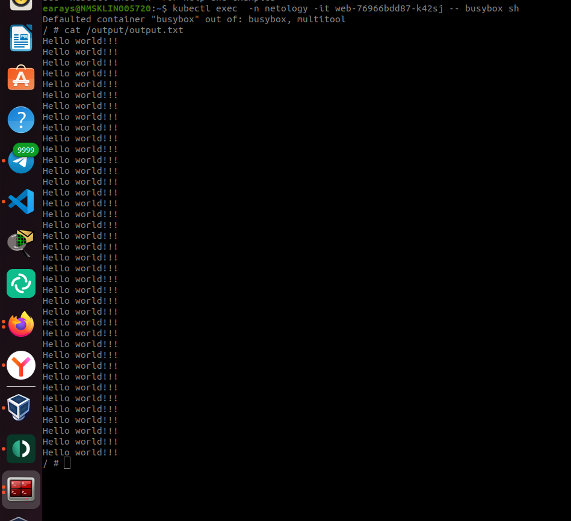
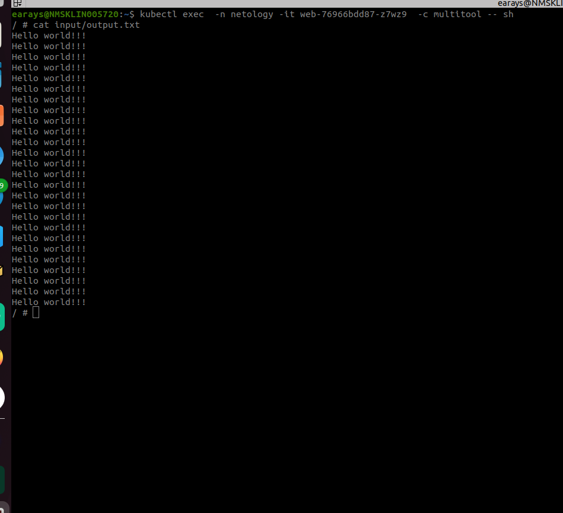
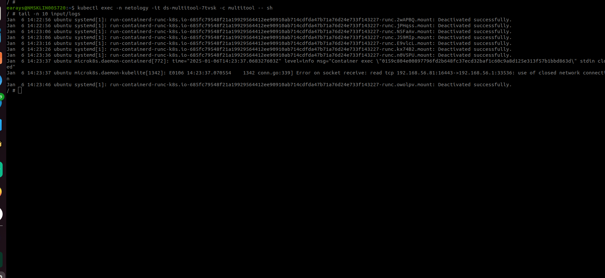

# Хранение в K8s. Часть 1

### Дополнительные материалы для выполнения задания

1. [Инструкция по установке MicroK8S](https://microk8s.io/docs/getting-started).
2. [Описание Volumes](https://kubernetes.io/docs/concepts/storage/volumes/).
3. [Описание Multitool](https://github.com/wbitt/Network-MultiTool).

------

### Задание 1 

**Что нужно сделать**

Создать Deployment приложения, состоящего из двух контейнеров и обменивающихся данными.

1. Создать Deployment приложения, состоящего из контейнеров busybox и multitool.

```yaml
apiVersion: apps/v1
kind: Deployment
metadata:
  name: web
  namespace: netology
  labels:
    app: web
spec:
  replicas: 1
  selector:
    matchLabels:
      app: web
  template:
    metadata:
      labels:
        app: web
    spec:
      containers:
      - name: busybox
        image: busybox
        command: ['sh', '-c', 'while true; do echo Hello world!!! >> /output/output.txt; sleep 5; done']
        volumeMounts:
        - name: volume
          mountPath: /output
      - name: multitool
        image: wbitt/network-multitool:latest
        ports:
        - containerPort: 8080
        env:
        - name: HTTP_PORT
          value: "8080"
        volumeMounts:
        - name: volume
          mountPath: /input
      volumes:
      - name: volume
        emptyDir: {}
```

2. Сделать так, чтобы busybox писал каждые пять секунд в некий файл в общей директории.
3. Обеспечить возможность чтения файла контейнером multitool.
4. Продемонстрировать, что multitool может читать файл, который периодоически обновляется.





5. Предоставить манифесты Deployment в решении, а также скриншоты или вывод команды из п. 4.

[deployment](./deploy_busybox_multitools.yml)

------

### Задание 2

**Что нужно сделать**

Создать DaemonSet приложения, которое может прочитать логи ноды.

1. Создать DaemonSet приложения, состоящего из multitool.

```yaml 
apiVersion: apps/v1
kind: DaemonSet
metadata:
  name: ds-multitool
  namespace: netology
  labels:
    app: ds-multitool
spec:
  selector:
    matchLabels:
      app: ds-multitool
  template:
    metadata:
      labels:
        app: ds-multitool
    spec:
      containers:
      - name: multitool
        image: wbitt/network-multitool
        volumeMounts:
        - name: volume
          mountPath: /input/logs
        ports:
        - containerPort: 8080
      volumes:
      - name: volume
        hostPath:
          path: /var/log/syslog
```

2. Обеспечить возможность чтения файла `/var/log/syslog` кластера MicroK8S.
3. Продемонстрировать возможность чтения файла изнутри пода.
4. Предоставить манифесты Deployment, а также скриншоты или вывод команды из п. 2.



[daemonset](./daemonset_multitools.yaml)
