# Дипломный практикум в Yandex.Cloud - `Арайс Эрик`

 * [Цели:](#цели)
  * [Этапы выполнения:](#этапы-выполнения)
     * [Создание облачной инфраструктуры](#создание-облачной-инфраструктуры)
     * [Создание Kubernetes кластера](#создание-kubernetes-кластера)
     * [Создание тестового приложения](#создание-тестового-приложения)
     * [Подготовка cистемы мониторинга и деплой приложения](#подготовка-cистемы-мониторинга-и-деплой-приложения)
     * [Установка и настройка CI/CD](#установка-и-настройка-cicd)
  * [Что необходимо для сдачи задания?](#что-необходимо-для-сдачи-задания)
  * [Как правильно задавать вопросы дипломному руководителю?](#как-правильно-задавать-вопросы-дипломному-руководителю)

**Перед началом работы над дипломным заданием изучите [Инструкция по экономии облачных ресурсов](https://github.com/netology-code/devops-materials/blob/master/cloudwork.MD).**

---
## Цели:

1. Подготовить облачную инфраструктуру на базе облачного провайдера Яндекс.Облако.
2. Запустить и сконфигурировать Kubernetes кластер.
3. Установить и настроить систему мониторинга.
4. Настроить и автоматизировать сборку тестового приложения с использованием Docker-контейнеров.
5. Настроить CI для автоматической сборки и тестирования.
6. Настроить CD для автоматического развёртывания приложения.

---
## Этапы выполнения:


### Создание облачной инфраструктуры

Для начала необходимо подготовить облачную инфраструктуру в ЯО при помощи [Terraform](https://www.terraform.io/).

Особенности выполнения:

- Бюджет купона ограничен, что следует иметь в виду при проектировании инфраструктуры и использовании ресурсов;
Для облачного k8s используйте региональный мастер(неотказоустойчивый). Для self-hosted k8s минимизируйте ресурсы ВМ и долю ЦПУ. В обоих вариантах используйте прерываемые ВМ для worker nodes.

Предварительная подготовка к установке и запуску Kubernetes кластера.

1. Создайте сервисный аккаунт, который будет в дальнейшем использоваться Terraform для работы с инфраструктурой с необходимыми и достаточными правами. Не стоит использовать права суперпользователя
2. Подготовьте [backend](https://www.terraform.io/docs/language/settings/backends/index.html) для Terraform:  
   а. Рекомендуемый вариант: S3 bucket в созданном ЯО аккаунте(создание бакета через TF)
   б. Альтернативный вариант:  [Terraform Cloud](https://app.terraform.io/)  
3. Создайте VPC с подсетями в разных зонах доступности.
4. Убедитесь, что теперь вы можете выполнить команды `terraform destroy` и `terraform apply` без дополнительных ручных действий.
5. В случае использования [Terraform Cloud](https://app.terraform.io/) в качестве [backend](https://www.terraform.io/docs/language/settings/backends/index.html) убедитесь, что применение изменений успешно проходит, используя web-интерфейс Terraform cloud.

Ожидаемые результаты:

1. Terraform сконфигурирован и создание инфраструктуры посредством Terraform возможно без дополнительных ручных действий.
2. Полученная конфигурация инфраструктуры является предварительной, поэтому в ходе дальнейшего выполнения задания возможны изменения.

---
### Создание Kubernetes кластера

На этом этапе необходимо создать [Kubernetes](https://kubernetes.io/ru/docs/concepts/overview/what-is-kubernetes/) кластер на базе предварительно созданной инфраструктуры.   Требуется обеспечить доступ к ресурсам из Интернета.

Это можно сделать двумя способами:

1. Рекомендуемый вариант: самостоятельная установка Kubernetes кластера.  
   а. При помощи Terraform подготовить как минимум 3 виртуальных машины Compute Cloud для создания Kubernetes-кластера. Тип виртуальной машины следует выбрать самостоятельно с учётом требовании к производительности и стоимости. Если в дальнейшем поймете, что необходимо сменить тип инстанса, используйте Terraform для внесения изменений.  
   б. Подготовить [ansible](https://www.ansible.com/) конфигурации, можно воспользоваться, например [Kubespray](https://kubernetes.io/docs/setup/production-environment/tools/kubespray/)  
   в. Задеплоить Kubernetes на подготовленные ранее инстансы, в случае нехватки каких-либо ресурсов вы всегда можете создать их при помощи Terraform.
2. Альтернативный вариант: воспользуйтесь сервисом [Yandex Managed Service for Kubernetes](https://cloud.yandex.ru/services/managed-kubernetes)  
  а. С помощью terraform resource для [kubernetes](https://registry.terraform.io/providers/yandex-cloud/yandex/latest/docs/resources/kubernetes_cluster) создать **региональный** мастер kubernetes с размещением нод в разных 3 подсетях      
  б. С помощью terraform resource для [kubernetes node group](https://registry.terraform.io/providers/yandex-cloud/yandex/latest/docs/resources/kubernetes_node_group)
  
Ожидаемый результат:

1. Работоспособный Kubernetes кластер.
2. В файле `~/.kube/config` находятся данные для доступа к кластеру.
3. Команда `kubectl get pods --all-namespaces` отрабатывает без ошибок.

---
### Создание тестового приложения

Для перехода к следующему этапу необходимо подготовить тестовое приложение, эмулирующее основное приложение разрабатываемое вашей компанией.

Способ подготовки:

1. Рекомендуемый вариант:  
   а. Создайте отдельный git репозиторий с простым nginx конфигом, который будет отдавать статические данные.  
   б. Подготовьте Dockerfile для создания образа приложения.  
2. Альтернативный вариант:  
   а. Используйте любой другой код, главное, чтобы был самостоятельно создан Dockerfile.

Ожидаемый результат:

1. Git репозиторий с тестовым приложением и Dockerfile.
2. Регистри с собранным docker image. В качестве регистри может быть DockerHub или [Yandex Container Registry](https://cloud.yandex.ru/services/container-registry), созданный также с помощью terraform.

---
### Подготовка cистемы мониторинга и деплой приложения

Уже должны быть готовы конфигурации для автоматического создания облачной инфраструктуры и поднятия Kubernetes кластера.  
Теперь необходимо подготовить конфигурационные файлы для настройки нашего Kubernetes кластера.

Цель:
1. Задеплоить в кластер [prometheus](https://prometheus.io/), [grafana](https://grafana.com/), [alertmanager](https://github.com/prometheus/alertmanager), [экспортер](https://github.com/prometheus/node_exporter) основных метрик Kubernetes.
2. Задеплоить тестовое приложение, например, [nginx](https://www.nginx.com/) сервер отдающий статическую страницу.

Способ выполнения:
1. Воспользоваться пакетом [kube-prometheus](https://github.com/prometheus-operator/kube-prometheus), который уже включает в себя [Kubernetes оператор](https://operatorhub.io/) для [grafana](https://grafana.com/), [prometheus](https://prometheus.io/), [alertmanager](https://github.com/prometheus/alertmanager) и [node_exporter](https://github.com/prometheus/node_exporter). Альтернативный вариант - использовать набор helm чартов от [bitnami](https://github.com/bitnami/charts/tree/main/bitnami).

2. Если на первом этапе вы не воспользовались [Terraform Cloud](https://app.terraform.io/), то задеплойте и настройте в кластере [atlantis](https://www.runatlantis.io/) для отслеживания изменений инфраструктуры. Альтернативный вариант 3 задания: вместо Terraform Cloud или atlantis настройте на автоматический запуск и применение конфигурации terraform из вашего git-репозитория в выбранной вами CI-CD системе при любом комите в main ветку. Предоставьте скриншоты работы пайплайна из CI/CD системы.

Ожидаемый результат:
1. Git репозиторий с конфигурационными файлами для настройки Kubernetes.
2. Http доступ к web интерфейсу grafana.
3. Дашборды в grafana отображающие состояние Kubernetes кластера.
4. Http доступ к тестовому приложению.

---
### Установка и настройка CI/CD

Осталось настроить ci/cd систему для автоматической сборки docker image и деплоя приложения при изменении кода.

Цель:

1. Автоматическая сборка docker образа при коммите в репозиторий с тестовым приложением.
2. Автоматический деплой нового docker образа.

Можно использовать [teamcity](https://www.jetbrains.com/ru-ru/teamcity/), [jenkins](https://www.jenkins.io/), [GitLab CI](https://about.gitlab.com/stages-devops-lifecycle/continuous-integration/) или GitHub Actions.

Ожидаемый результат:

1. Интерфейс ci/cd сервиса доступен по http.
2. При любом коммите в репозиторие с тестовым приложением происходит сборка и отправка в регистр Docker образа.
3. При создании тега (например, v1.0.0) происходит сборка и отправка с соответствующим label в регистри, а также деплой соответствующего Docker образа в кластер Kubernetes.

---
## Что необходимо для сдачи задания?

1. Репозиторий с конфигурационными файлами Terraform и готовность продемонстрировать создание всех ресурсов с нуля.
2. Пример pull request с комментариями созданными atlantis'ом или снимки экрана из Terraform Cloud или вашего CI-CD-terraform pipeline.
3. Репозиторий с конфигурацией ansible, если был выбран способ создания Kubernetes кластера при помощи ansible.
4. Репозиторий с Dockerfile тестового приложения и ссылка на собранный docker image.
5. Репозиторий с конфигурацией Kubernetes кластера.
6. Ссылка на тестовое приложение и веб интерфейс Grafana с данными доступа.
7. Все репозитории рекомендуется хранить на одном ресурсе (github, gitlab)


------


## Ответ


## Этапы выполнения:


### Создание облачной инфраструктуры

Переходим в папку _Diplom/sa_, выполняем `terraform init`, `terraform plan` и `terraform apply`. Результат - создание сервисного аккаунта, статического ключа и `bucket`.

Созданный `bucket`
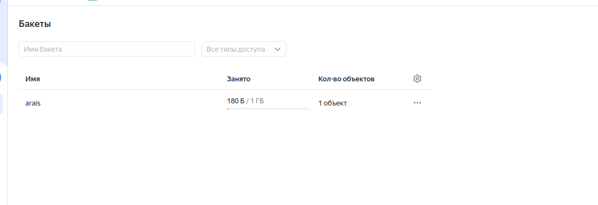

Окрываем providers.tf и снимаем коментирование на `backend`
```
terraform {
  required_providers {
    yandex = {
      source = "yandex-cloud/yandex"
    }
  }
  required_version = ">=0.13"

  # backend "s3" {
  #   endpoints = {
  #     s3 = "https://storage.yandexcloud.net"
  #   }
  #   # endpoints.s3 = "https://storage.yandexcloud.net"
  #   bucket = "arais"
  #   region = "ru-central1"
  #   key    = "terraform.tfstate"

  #   skip_region_validation      = true
  #   skip_credentials_validation = true
  #   skip_requesting_account_id  = true # необходимая опция при описании бэкенда для Terraform версии 1.6.1 и старше.
  #   skip_s3_checksum            = true # необходимая опция при описании бэкенда для Terraform версии 1.6.3 и старше.
  # }
}

provider "yandex" {
  token     = var.token
  cloud_id  = var.cloud_id
  folder_id = var.folder_id
  zone      = var.default_zone
}
```

Второй вариант создания сервисного аккаунта и bucket через консоль yc

```
shaman@hulk:~/project
% yc iam service-account create --name bucket                                                              24-10-12 - 23:07:14
done (1s)
id: ajevksn4ld3h332tu53b
folder_id: b1gfsa2tbdkktui2b7qs
created_at: "2024-10-12T20:30:04.720272867Z"
name: bucket


shaman@hulk:~/project
% yc storage bucket create --name arais                                                                 24-10-12 - 23:30:06
name: arais
folder_id: b1gfsa2tbdkktui2b7qs
anonymous_access_flags:
  read: false
  list: false
default_storage_class: STANDARD
versioning: VERSIONING_DISABLED
acl: {}
created_at: "2024-10-12T20:41:40.394018Z"
```

Получаем ID созданного bucket и задаем роль editor для сервисного аккаунта bucket

```
shaman@hulk:~/project
% yc storage bucket list                                                                              :( 1 24-10-12 - 23:52:12
+----------+----------------------+----------+-----------------------+---------------------+
|   NAME   |      FOLDER ID       | MAX SIZE | DEFAULT STORAGE CLASS |     CREATED AT      |
+----------+----------------------+----------+-----------------------+---------------------+
| arais    | b1gfsa2tbdkktui2b7qs |        0 | STANDARD              | 2024-10-12 20:41:40 |
+----------+----------------------+----------+-----------------------+---------------------+


shaman@hulk:~/project
% yc resource-manager folder add-access-binding b1gfsa2tbdkktui2b7qs \                                     24-10-12 - 23:53:08
  --role editor \
  --subject serviceAccount:ajevksn4ld3h332tu53b
done (2s)
effective_deltas:
  - action: ADD
    access_binding:
      role_id: editor
      subject:
        id: ajevksn4ld3h332tu53b
        type: serviceAccount
```

Устанавливаем максимальный размер bucket

```
shaman@hulk:~/project
% yc storage bucket update \                                                                           :( 1 24-10-13 - 0:00:13
  --name arais \            
  --max-size 1073741824
name: arais
folder_id: b1gfsa2tbdkktui2b7qs
default_storage_class: STANDARD
versioning: VERSIONING_DISABLED
max_size: "1073741824"
acl: {}
created_at: "2024-10-12T20:41:40.394018Z"
```

Настраиваем публичный доступ к bucket

```
shaman@hulk:~/project
% yc storage bucket update \                                                                                24-10-13 - 0:01:20
  --name arais \
  --public-read \
  --public-list \
  --public-config-read
name: arais
folder_id: b1gfsa2tbdkktui2b7qs
anonymous_access_flags:
  read: true
  list: true
  config_read: true
default_storage_class: STANDARD
versioning: VERSIONING_DISABLED
max_size: "1073741824"
acl: {}
created_at: "2024-10-12T20:41:40.394018Z"
```

Создаем статический ключ

```
shaman@hulk:~/project
% yc iam access-key create --service-account-name bucket                                                    24-10-13 - 0:05:51
access_key:
  id: ajege5u9d5h90cnc2nrb
  service_account_id: ajevksn4ld3h332tu53b
  created_at: "2024-10-12T21:28:15.827955412Z"
  key_id: YC************
secret: YC**********
```

Добавляем в переменные окружения идентификатор ключа и секретный ключ
```
shaman@hulk:~/project
% export ACCESS_KEY="YC************"                                                             24-10-13 - 0:28:17

shaman@hulk:~/project
% export SECRET_KEY="YC**********"  
```

Инициируем `backend`
```
terraform init -backend-config="access_key=$ACCESS_KEY" -backend-config="secret_key=$SECRET_KEY"
```
Созданный `bucket`


Переходим в папку _Diplom/terraform_, выполняем `terraform init`, `terraform plan` и `terraform apply`. Результат - создание требуемой инфраструктуры

Подсети в разных зонах доступности


Виртуальные машины в разных подсетях


Выполнение `terraform destroy` проходит без ошибок


После создания ифраструктуры выполням в терминале
```
cp ./hosts.cfg ../ansible/inventory/hosts.ini  
```

Переходим в папку _Diplom/ansible_ и ко второму заданию.

---
### Создание Kubernetes кластера


 В папке запускаем `playbook`
```
 ansible-playbook -i inventory/hosts.ini playbook.yml
 ___________________________________
< PLAY [install docker and kubectl] >
 -----------------------------------
        \   ^__^
         \  (oo)\_______
            (__)\       )\/\
                ||----w |
                ||     ||

 ________________________
< TASK [Gathering Facts] >
 ------------------------
        \   ^__^
         \  (oo)\_______
            (__)\       )\/\
                ||----w |
                ||     ||

ok: [51.250.80.23]
ok: [51.250.32.190]
ok: [62.84.121.182]
ok: [62.84.120.31]

```

После завершения `playbook` имеем развёрнутый кластер и систему мониторинга


---
### Создание тестового приложения


Подготавливаем `Dockerfile` и наполняем его содержимым

```
FROM debian:stable
RUN apt-get update && apt-get install -y curl nginx
COPY ./html/ /var/www/html
ENTRYPOINT ["nginx", "-g", "daemon off;"]
EXPOSE 80
```

Выполняем сборку и выгрузку в реестр
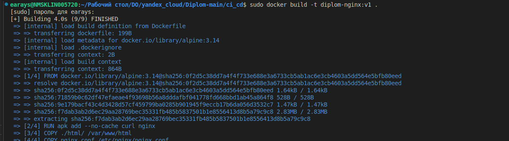

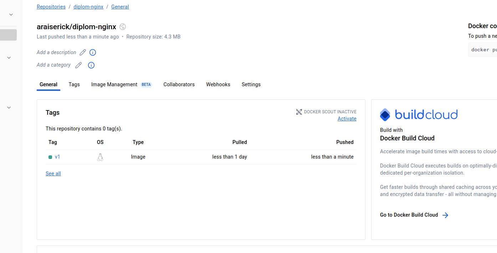

Разворачиваем `deploy` в кластере. Пример файла конфигурации в корне каталога `Diplom` (Diplom/deployment.yaml)
```
apiVersion: apps/v1
kind: Deployment
metadata:
  labels:
    app: web
  name: web
spec:
  replicas: 1
  selector:
    matchLabels:
      app: web
  template:
    metadata:
      labels:
        app: web
    spec:
      containers:
      - image: arais/diplom-nginx:v1
        ports:
        - containerPort: 80
      # terminationGracePeriodSeconds: 30

---
apiVersion: v1
kind: Service
metadata:
  name: web
spec:
  ports:
    - name: http
      port: 80
      nodePort: 30080
  selector:
    app: web
  type: NodePort
```

Результат
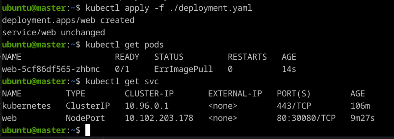


---
### Подготовка cистемы мониторинга и деплой приложения

Helm-chart с мониторингом был добавлен на втором этапе, вместе с развертыванием кластера.  
Для доступа к мониторингу из интернета использован `svс.yaml` который предоставляет доступ к `Grafana` по 30090 порту 
# ("login: admin"; "password: prom-operator")
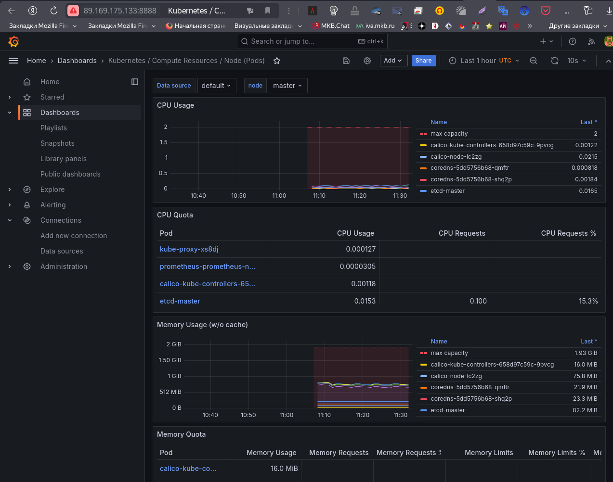


---
### Установка и настройка CI/CD

Для выполнения задания выбран `Gitlab CI`, [ссылка](https://gitlab.com/Zhivarev/diplom-nginx)  
Конфигурация конвеера:
```
stages:
  - build
  - deploy
image: docker:cli
services:
  - docker:dind
variables:
  DOCKER_IMAGE_NAME: $CI_REGISTRY_IMAGE:$CI_COMMIT_SHORT_SHA
  REGISTRY: registry.gitlab.com
  PROJECT_NAME: Zhivarev/diplom-nginx

build-tag:
  stage: build
  script:
    - echo "$CI_REGISTRY_PASSWORD" | docker login $CI_REGISTRY -u $CI_REGISTRY_USER --password-stdin
    - docker build --cache-from $CI_REGISTRY_IMAGE:latest --tag $CI_REGISTRY_IMAGE:$CI_COMMIT_TAG --tag $CI_REGISTRY_IMAGE:latest .
    - docker push $CI_REGISTRY_IMAGE:$CI_COMMIT_TAG
    - docker push $CI_REGISTRY_IMAGE:latest
  rules:
  - if: $CI_COMMIT_TAG =~ /^v\d+.\d+/

build-branch:
  stage: build
  script:
    - echo "$CI_REGISTRY_PASSWORD" | docker login $CI_REGISTRY -u $CI_REGISTRY_USER --password-stdin
    - docker build -t $CI_REGISTRY_IMAGE:$CI_COMMIT_SHORT_SHA .
    - docker push $CI_REGISTRY_IMAGE:$CI_COMMIT_SHORT_SHA
  rules:
    - if: $CI_COMMIT_BRANCH == 'main'

deploy:
  stage: deploy
  image:
    name: bitnami/kubectl:latest
    entrypoint: ['']
  script:
    - kubectl config get-contexts
    - kubectl config use-context Zhivarev/diplom-nginx:diplom-agent
    - kubectl set image deployment web *=$CI_REGISTRY_IMAGE:$CI_COMMIT_TAG
    - kubectl rollout restart deployment/web -n default
  rules:
  - if: $CI_COMMIT_TAG =~ /^v\d+.\d+/
```

При коммите происходит сборка и отправка `docker` контейнера в `GitLab container registry`.  
При создании тэга создаются два `docker` контейнера с версией тэга и `latest`. Следующим шагом конвеер отправляет путь до кластера kubernetes и устанавливает последнюю версию.
Создаём новый тэг
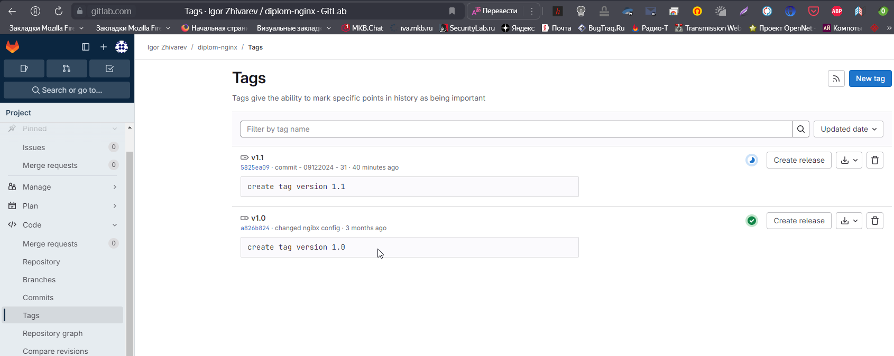

Происходят сборка и обновление деплоя
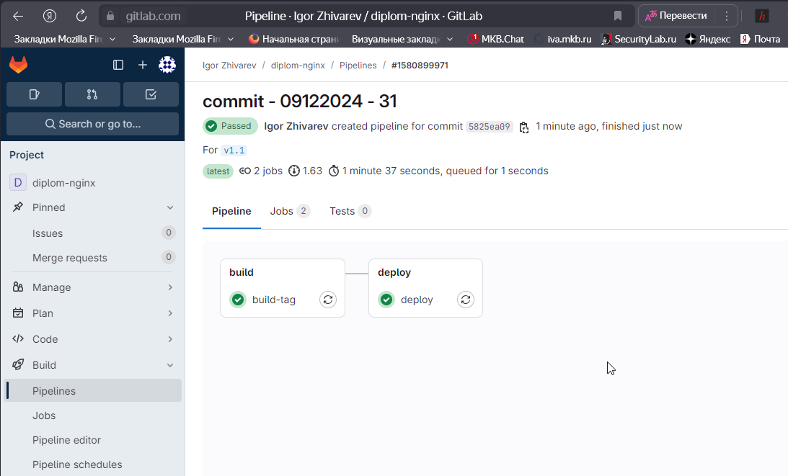

В кластере `pod` перезапустился - изменилось имя `pod`
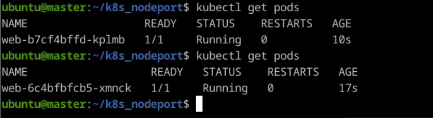

На странице web-сайта тоже видны изменения  
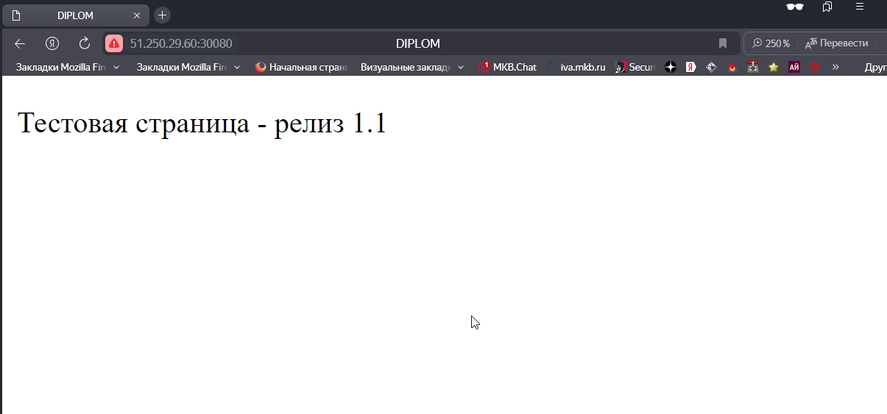  
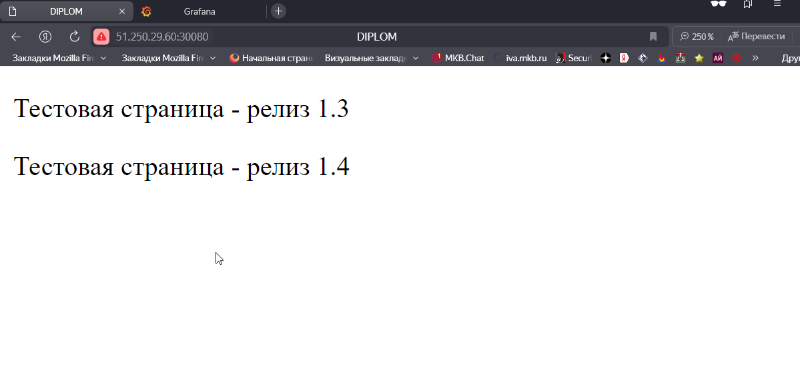  

Общая картина отработавших задач
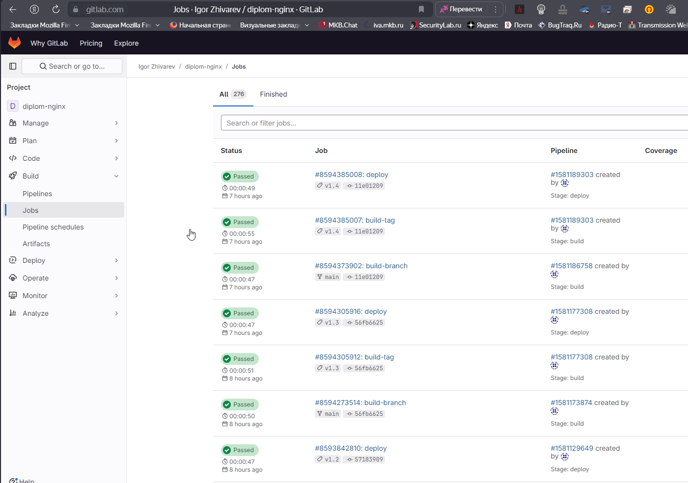

Отработавшие коммиты
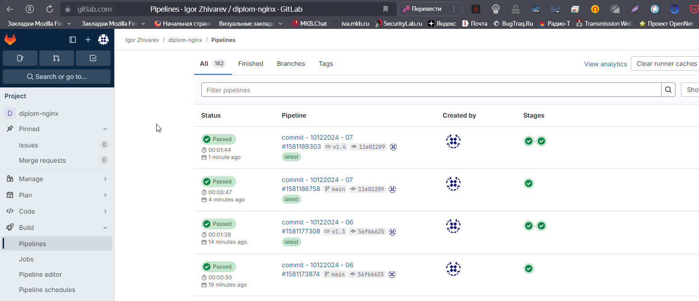

Состояние `GitLab container registry`
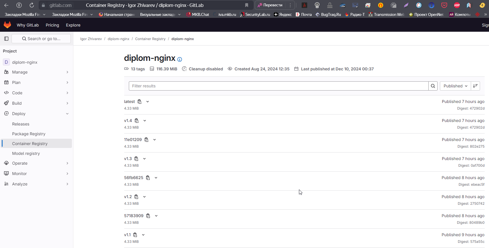
